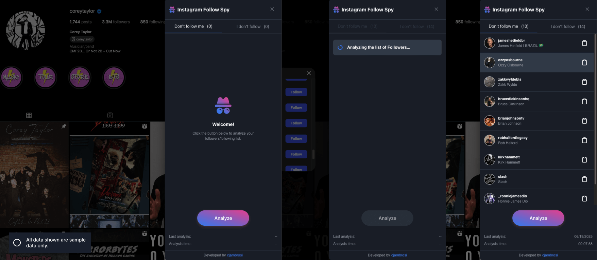

  

# Instagram Follow Spy

A [web scraper](https://en.wikipedia.org/wiki/Web_scraping) script for Instagram Web that allows you to find out who doesn't follow you and who you don't follow back, all through a pleasant and intuitive interface. You can also view the most recent analysis performed.

## Usage

In your browser, install a script manager extension.

Suggestions:

- [Violentmonkey](https://violentmonkey.github.io) - *Recommended*
- [Tampermonkey](https://www.tampermonkey.net)
- [Greasemonkey](https://www.greasespot.net) - *Firefox only*

### Install from GreasyFork (*Recommended*)

Go to the [script page on GreasyFork](), then click the "Install this script" button and follow the installation process in your extension.

### Install from GitHub

Click on file `script.user.js`, then click `Raw` button to install it.

## Contributing

Contributors are welcome! :metal:

Please check out the [CONTRIBUTING](CONTRIBUTING.md).

You can also:

- :star2: give a star in this repository
- :heavy_heart_exclamation: share this project and recommending it to your friends
